```{r setup, include=FALSE, echo=FALSE}
```

# ¿Que es ODK?


Es un software gratuito y de código abierto para recopilar, gestionar y utilizar datos en entornos con recursos limitados.

.pull-left[
.center[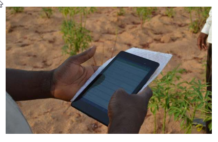]
.center[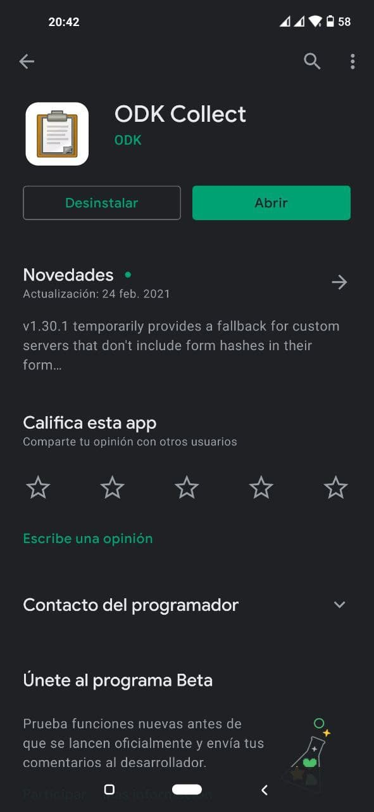]
]

.pull-right[
.center[]
.center[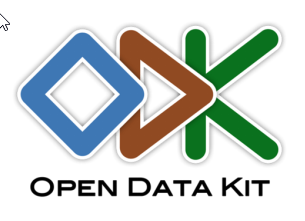]
]

---

# ¿Para que sirve?

- Recopilar una gran variedad de información, por ejemplo, formularios electrónicos, datos numéricos y datos geográficos, texto, fotos, videos, código de barras, audio y otros.

- Esto, además de permitir ahorrar costos y gran cantidad de tiempo, evita la recolección de información manual con formularios en papel, que luego deben ser digitalizados, organizados, analizados y presentados.


<p>
<br />
<br />
<br />
</p>

.center[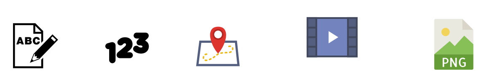]
---

# Tipos de datos que podemos recolectar

.center[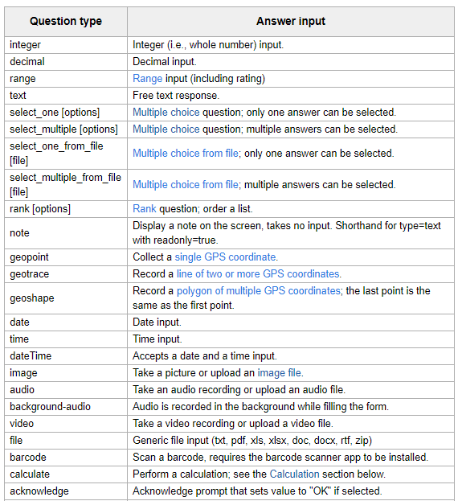]


---

# ¿Como funciona?

.center[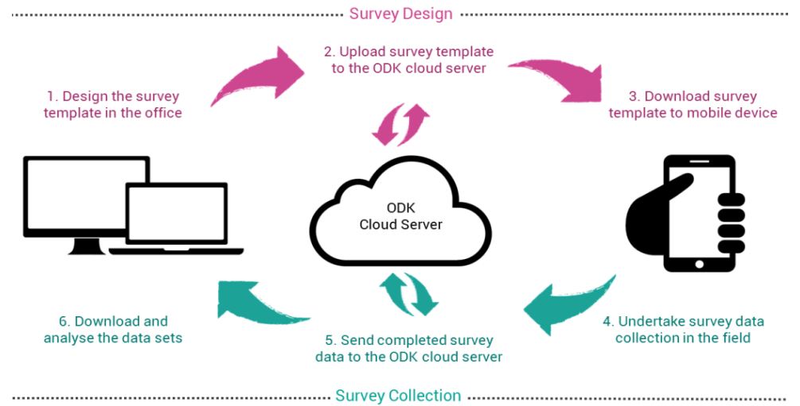]

---

# Diseños de formulario

.pull-left[
.center[

[https://xlsform.org/en/](https://xlsform.org/en/)]
<p>
<br />

</p>

.center[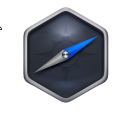

[ODKbuild](https://build.getodk.org)]

]


.pull-right[
<p>
<br />
<br />
<br />
<br />
<br />
<br />
<h1>    Servidores</h1>

</p>
]

---

# Servidores
<p>
<br />
<br />


</p>
.center[]


---

# Uso de la información

<h3 align="center"> Formatos: CSV, xlsx, KML, etc.. </h3>
.pull-left[

.center[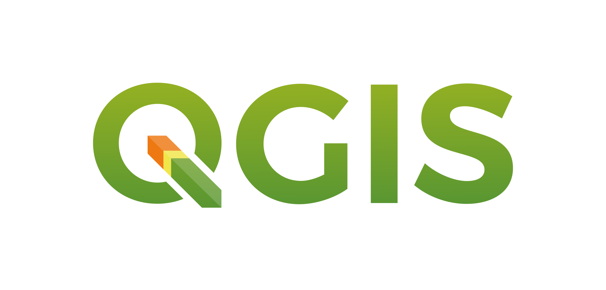]
.center[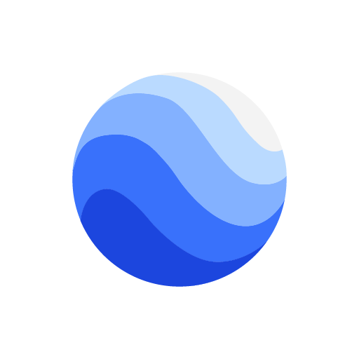]

]

.pull-right[

.center[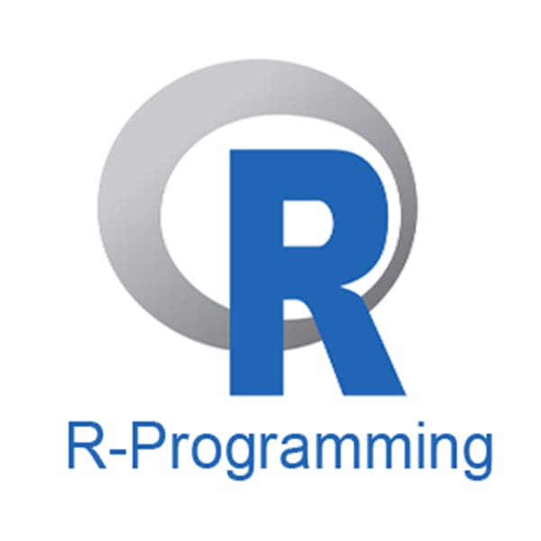]

]
---
# Ejemplos

- El [“Jane Goodall Institute”](https://youtu.be/CNXv8EEs0P8) usa ODK para la conservación del hábitat de los chimpancés en Tanzania.

- En india el [“The Madras Crocodile Bank Trust & Centre for Herpetology”](https://youtu.be/kl9LXKf7b6c) usa ODK para la prevención de mordeduras de serpientes

- El pueblo indígena [Surui](https://youtu.be/LvJYdoTssMQ) en Brasil implementan ODK para monitorear sus bosques.

- Koji Foruse profesor en [“Teikyo University of Science”](https://youtu.be/aVJsWs72s_8) en Japon usa ODK para construir dentro de los parques naturales y areas de preservación Ambiental, centros naturales que facilitan la educación y a guiar a sus visitantes.

.center[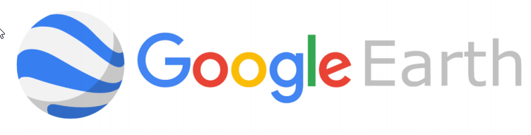
]
---

# ¿Que es R?

- Es un lenguaje de programación muy sencillo  

- Usado principalmente en la investigacón cientifica
- Posee una interface de usuario muy potente e intuitiva (Rstudio)

.center[]
---

# Rmarkdown

- R Markdown es un formato que permite una fácil creación de documentos, presentaciones dinámicas y informes de R.  

- Los archivos para producir documentos R Markdown tienen extensión **.Rmd**  

- El resultado es un documento en formato **.pdf**, **.html**, o **.doc**

.center[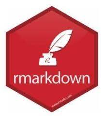]
---
QR

.center[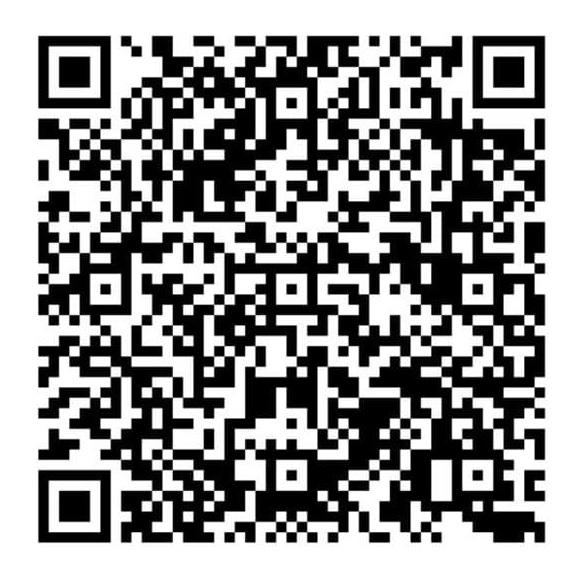]

---

class: center, middle, inverse, hide-logo
background-size: 55px
background-position: 9% 15%

# Gracias `r emo::ji("smile")`

### Esta presentacion ha sido creada con [xaringan](https://github.com/yihui/xaringan) y [R Markdown](https://rmarkdown.rstudio.com/)

`r icon::fa("envelope")`**dafealos@gmail.com**  
`r icon::fa("home")`[**https://dafealos.netlify.app**](https://dafealos.netlify.app)  
`r icon::fa_twitter()`[**@dafealos**](https://twitter.com/dafealos)  

---

class: center, middle, inverse, hide-logo

.center[


¡Manos a la obra!
]