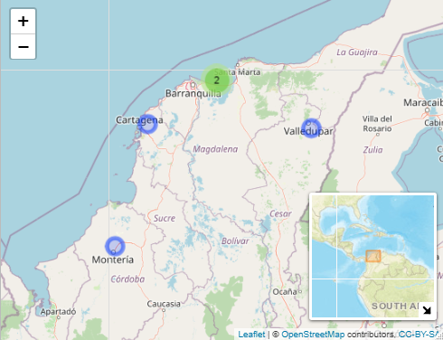

```{r, include=FALSE}
knitr::opts_chunk$set(echo = FALSE, message = FALSE, warning = FALSE,
                      fig.cap = TRUE,
  tab.cap.pre = "Tabla ", fig.cap.pre = "Figura ")

library(officedown)
library(officer)
library(kableExtra)
library(patchwork)
library(tidyverse)
library(flextable)
library(koboloadeR)

kobo_data_downloader("650683", "flisol_2021:flisol_2021") # Importat el proyecto

# creamos un data frame con las variables de interes y modificamos algunos nombres
DF <- data_650683 %>% 
  select(ultima_compra, nombre, edad,sexo, gusto_flisol, "_ubicacion_latitude", "_ubicacion_longitude") %>% 
  rename(latitud = "_ubicacion_latitude" , longitud = "_ubicacion_longitude")


# Mapa --------------------------------------------------------------------


hombres <- DF %>% select(edad, sexo) %>%  filter(sexo == "Hombre") %>% mutate(Grupos = case_when(edad >= 0 & edad <=10 ~ "0-10",
                                                                         edad >= 11 & edad <=20 ~ "11-20",
                                                                         edad >= 21 & edad <=40 ~ "21-30",
                                                                         edad >= 31 & edad <=40 ~ "31-40",
                                                                         edad >= 41 & edad <=50 ~ "41-50",
                                                                         edad >= 51 & edad <=60 ~ "51-60",
                                                                         edad >= 61 & edad <=70 ~ "61-70",
                                                                         edad >= 71 & edad <=80 ~ "71-80",
                                                                         edad >= 81 & edad <=90 ~ "81-90",
                                                                         edad >= 91 & edad <=100 ~ "91-100"
)) %>% group_by(Grupos) %>% summarise(numero = n()) %>% 
  mutate(porcentaje = round((numero/sum(numero))*100,2)*-1) %>% mutate(sexo = "Hombre")

mujer <- DF %>% select(edad, sexo) %>%  filter(sexo == "Mujer") %>% mutate(Grupos = case_when(edad >= 0 & edad <=10 ~ "0-10",
                                                                         edad >= 11 & edad <=20 ~ "11-20",
                                                                         edad >= 21 & edad <=40 ~ "21-30",
                                                                         edad >= 31 & edad <=40 ~ "31-40",
                                                                         edad >= 41 & edad <=50 ~ "41-50",
                                                                         edad >= 51 & edad <=60 ~ "51-60",
                                                                         edad >= 61 & edad <=70 ~ "61-70",
                                                                         edad >= 71 & edad <=80 ~ "71-80",
                                                                         edad >= 81 & edad <=90 ~ "81-90",
                                                                         edad >= 91 & edad <=100 ~ "91-100"
)) %>% group_by(Grupos) %>% summarise(numero = n()) %>% 
  mutate(porcentaje = round((numero/sum(numero))*100,2)) %>% mutate(sexo = "Mujer")

comunidad <- bind_rows(hombres, mujer)


# Graficas ----------------------------------------------------------------

graf1 <- ggplot(data = comunidad,
    aes(x = Grupos,
        y = porcentaje, fill = sexo)
  ) +
  geom_col(position = "stack", alpha = 0.6, color = "white") + 
  coord_flip() +
  scale_fill_manual(values = c("midnightblue", "darkred")) +
  theme_bw() +
  theme(legend.position = "bottom",
    plot.caption = element_text(hjust = 0)) +
  scale_y_continuous(breaks = seq(-100, 100, by = 10), 
                     labels = c(rev(seq(0, 100, by = 10)), seq(10, 100, by = 10))) +
  labs(
    y = "Porcentaje",
    x = "Grupos de edades")


graf2 <- ggplot(DF) + geom_boxplot(aes(gusto_flisol, edad, fill =sexo), alpha = 0.6) + 
  labs(x="Gusto a Flisol", y = "Edades") + theme_bw() +
  theme(legend.position = "botoom", plot.caption = element_text(hjust = 0)) +
  scale_fill_manual(values = c("midnightblue", "darkred"))


```


# Introducción  

Este es un informe de la presentacion usando ODK y R en el Flisol-Caribe 2021 en el uso de herramientas libres, en la recolecta y automatización de analisis de datos.

# Materiales y metodos

## Area de estudio

vemos nuestra area de estudio en la figura \@ref(fig:mapa)

```{r, fig.cap= "Area de estudio", fig.id = "mapa"}

```
\newpage
## Metodos  

Se diseño un formulario usando una plantilla de Excel siguiendo las especificaciones de [ODK's Docs](https://docs.getodk.org), la cual fue implementada en el servidor KoboToolbox y fueron descargados, limpiados y analizados usando @rcore y el paquete Tydiverse creado por @wickham_2019     

# Resultados  

Se obtuvieron un total de `r nrow(DF)` registros, ver tabla \@ref(tab:datos)  


```{r,echo=FALSE, tab.cap="Tabla de datos", tab.id = "datos"}
flextable::flextable(DF, cwidth = 1)

```

y el grafico de resultados en la figura \@ref(fig:juntas)

```{r, fig.cap= "vemos dos figuras juntas A) Poblacion B) Boxplot ",  fig.id = "juntas"}
(graf1 + graf2) + plot_annotation(tag_levels = "A")
```


# Conclusión  

Es muy práctico usar Rmarkdown

\newpage

# Bibliografía  


